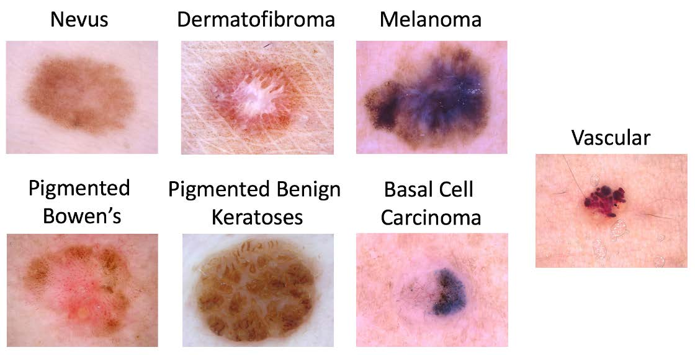
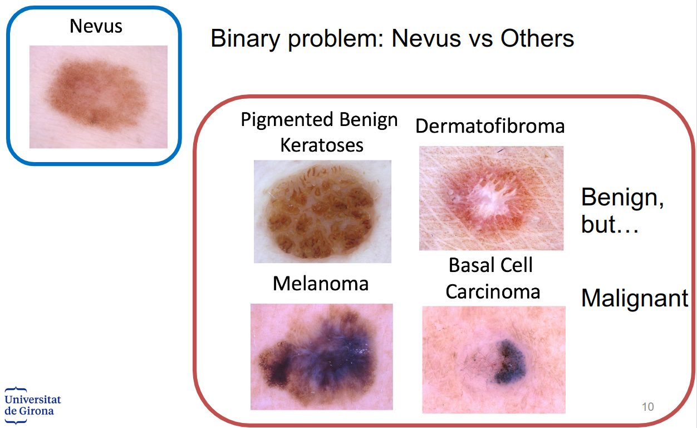
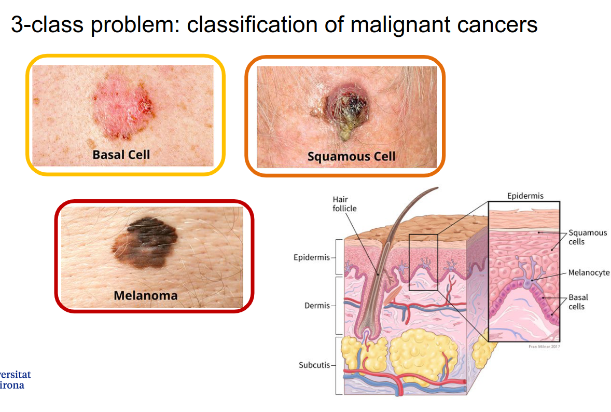
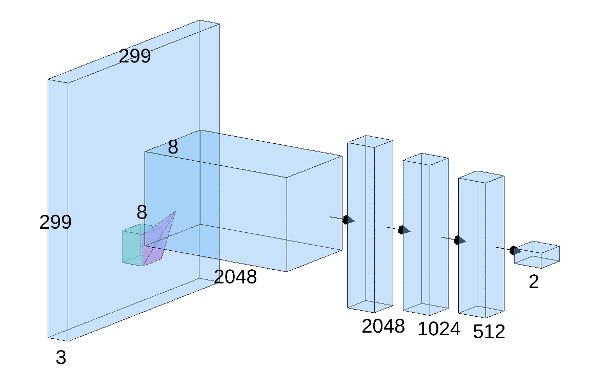
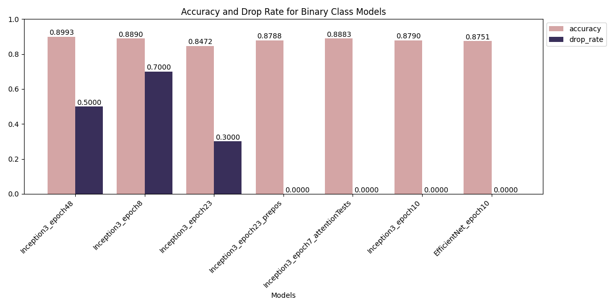

# Melanoma Detection Using Deep Learning

## Table of Contents

1. [**Introduction**](#introduction)
2. [**Objectives**](#objectives)
3. [**Data Description**](#data-description)
4. [**Folders**](#folders)
5. [**Installation and Usage**](#installation-and-usage) 
6. [**Model Architecture**](#model-architecture)
7. [**Results**](#results)
8. [**Contributing**](#contributing)
9. [**License**](#license)
10. [**Acknowledgments**](#acknowledgments)

## Introduction

The melanoma detection project is part of a larger initiative focused on Computer Aided Diagnosis (CADx). The main purpose of this project is to develop a CADx medical system that assists physicians in delivering diagnoses. Specifically, the project centers on skin analysis, with an emphasis on melanoma detection. This project involves implementing deep learning techniques to develop algorithms that can provide a second opinion in dermatological diagnoses, particularly in identifying and classifying melanoma from dermoscopic images.

## Objectives

The primary objectives of the project are as follows:

1. **Development of a CADx System**: Create a computer-aided diagnostic system for melanoma detection. This system aims to support healthcare professionals by providing reliable second opinions.
2. **Algorithm Development**: Develop and refine algorithms capable of diagnosing melanoma from dermoscopic images. These algorithms should be able to distinguish between nevi and malignant cancers.
3. **Deep Learning Approach**: Utilize deep learning techniques to enhance the accuracy and reliability of the diagnostic process. This involves a comprehensive review of current literature, followed by the application of advanced deep learning models.

## Data Description

The melanoma[^1] detection project utilizes a comprehensive dataset of dermoscopic images. This dataset is pivotal for the training and validation of deep learning models designed to distinguish between benign nevus[^2] and malignant melanoma.

The lesion images come from the HAM10000 Dataset (ViDIR Group,
Medical University of Vienna), the BCN_20000 Dataset (Hospital Clínic de Barcelona) and the MSK Dataset
(ISBI 2017), hence images were acquired with a variety of dermatoscope types and from different anatomic
sites. Images were acquired from a historical sample of patients that presented for skin cancer screening
from several different institutions.

*Figure 1: Example of the type of lesion in the dataset*

[^1]: a type of cancer that develops from the pigment-producing cells known as melanocytes.
[^2]: Nevus (pl.: nevi) is a nonspecific medical term for a visible, circumscribed, chronic lesion of the skin or mucosa

### Binary classification dataset

The binary problem of classifying Nevus images vs all the others. We will give you more than 15000 images, being half of them nevus and the other half a combination of abnormal areas to train the system. The test set will be open the last week of the project

*Figure 2: Details of the binary datset*

- 15195 images for training (with ground-truth), approx 50% nevus & lesions
- 3796 images for validation (with ground-truth), approx 50% nevus & lesions
-  XXXX images for testing (without ground-truth), unknown distribution

### Multiclass classification dataset

A three-class problem consisting on the classification of cancers: melanoma vs basal cell carcinoma vs squamous cell carcinoma. The training set consists on more than 5000 images, being 50% melanoma, 40% basal cell carcinoma and only 10% squamous cell carcinoma (imbalanced problem).

*Figure 3: Details of the Multi-class datset*

- 5082 images for training (with gtruth), approx 50% mel / 40% bcc / 10% scc
- 1270 images for validation (with gtruth), 50% mel / 40% bcc / 10% scc
- XXXX images for testing (without gtruth), unknown distribution

## Folders
- [**Classifiers**](classifiers): Network architecture, trainning, val and test files.
- [**Noteebooks**](noteebooks): Notebooks of the implementation of the deep learning classifier.
- [**Evaluation**](evaluation): Metrics use to evaluated our deep learning implementation.
- [**Utils**](utils): helping functions.
- [**Literature**](literature): Journals use to based this implementation.
- [**Generators**](generators): GAN implementation.

## Installation and Usage

### Requirements
- Python along with additional dependencies listed in a `requirements.txt` file.

### Creating a Virtual Environment
To avoid conflicts with other Python projects, it's recommended to create a virtual environment:
1. Install `virtualenv` if you haven't already: `pip install virtualenv`
2. Create a new virtual environment: `virtualenv venv` (or `python -m venv venv` if using Python's built-in venv)
3. Activate the virtual environment:
   - On Windows: `venv\Scripts\activate`
   - On macOS and Linux: `source venv/bin/activate`
4. Your command prompt should now show the name of the activated environment.

### Installation
1. With the virtual environment activated, install the necessary Python packages: `pip install -r requirements.txt`

## Model Architecture
### Binary Classification

After a lot of testing of different models, our best approach was using a transfer learning of `inception_v3` with the `Inception_V3_Weights` from the moodle `torchvision.models` version 0.15.2. We use a last classification layers with linear and Relu activations. We use the maxpooling from all the features of the `inception_v3` to get 2048, then a linnear layer to reduce them to 1024 and at last one to reduce them from 512 to 2 classes.

*Figure 4: Details of our Deep Learning layers*

In the next figure you can observe a detail result of our binary result test of different approach of the classifcation problem.

*Figure 5: Details of Binary testing scheme*

## Contributing
- [Yusuf B. Tanrıverdi](https://github.com/yusuftengriverdi)
- [Edwing Ulin](https://github.com/EdAlita)

## License
This project is licensed under the GNU GENERAL PUBLIC LICENSE - see the [LICENSE.md](LICENSE) file for details.

## Acknowledgments
